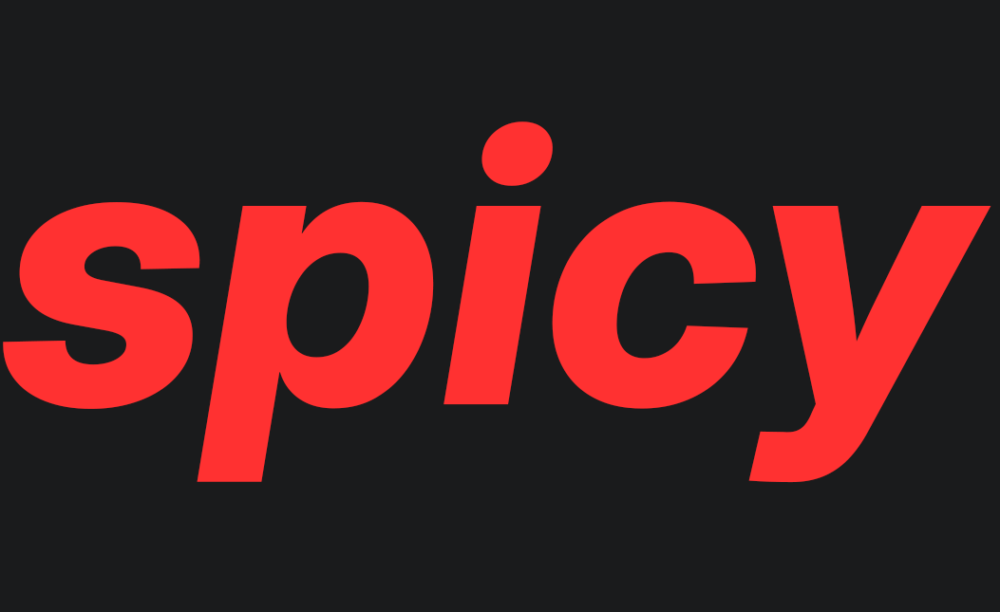
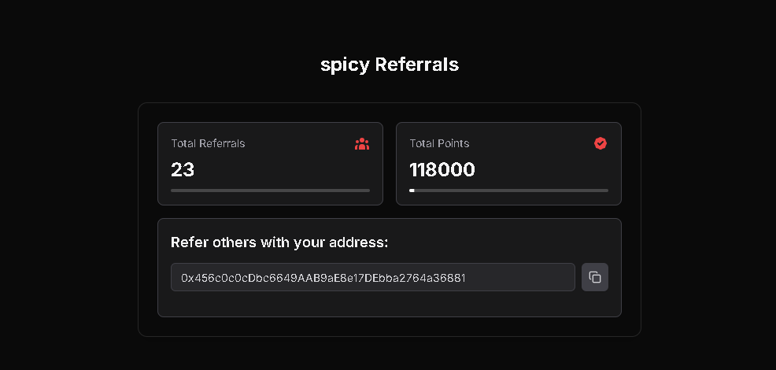
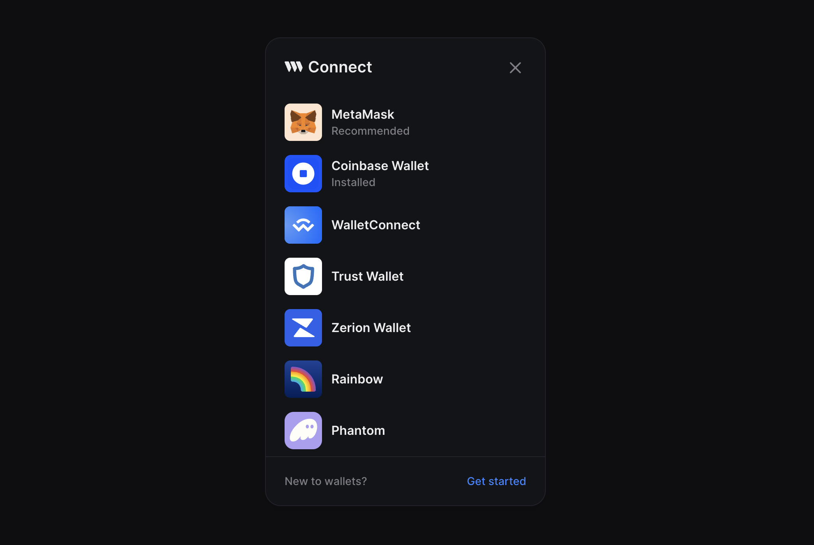

## Project Description

With **spicy**, dive into a revolutionary platform that transforms the way adult content is explored and monetized. Built on the cutting-edge principles of Web3, spicy offers a decentralized, blockchain-powered environment where users and creators can thrive in a token-based economy. 

Imagine a world where transparency and censorship resistance are not just ideals but realities. spicy leverages the power of IPFS for secure content storage, ensuring that your data is both safe and accessible. Transactions are seamless and efficient, powered by AVAX.

Unlike traditional platforms, spicy empowers creators and users alike, offering unparalleled control and ownership over their content and interactions. Engage with a community that values privacy and autonomy, where every transaction is recorded on the blockchain, providing an immutable and transparent ledger of activity.

Join us in this exciting journey to redefine the adult content industry. With spicy, you're not just a user; you're a stakeholder in a decentralized future. Whether you're a creator looking to monetize your work or a user seeking unique content, spicy offers a platform that is as rewarding as it is innovative.

---

## Tokenomics

### Total Supply

- **Total Supply**: 69,000,000 $SPICY tokens (fixed supply, non-mintable)
- **Token Type**: ERC-20
- **Decimals**: 18

### Token Allocation

1. **Community Rewards (45%) - 31,050,000 $SPICY**
   - **Purpose**: Incentivize user engagement, content creation, and staking.
   - **Emission Schedule**: Linear distribution over 5 years, with higher initial rewards.

2. **Presale and Liquidity (26%) - 17,940,000 $SPICY**
   - **Purpose**: Fund platform launch and provide liquidity for trading.
   - **Sale Terms**: Presale at fair market value; liquidity locked for 2 years.

3. **Treasury and Development (19%) - 13,110,000 $SPICY**
   - **Purpose**: Support platform growth, ecosystem development, and sustainability.
   - **Vesting**: Unlock over 4 years with a 6-month cliff.

4. **Team and Advisors (10%) - 6,900,000 $SPICY**
   - **Purpose**: Reward the founding team and advisors.
   - **Vesting**: Vesting over 4 years with a 12-month cliff.

---

## Referral System

The spicy referral system is designed to reward users for bringing new members to the platform. Here's how it works:

- **Referral Address**: New users can submit a referral address to get started participating in the referral program.

- **Share Your Address**: Participants can share their referral address with potential new users.

- **Rewards**: Both the referrer and the new user receive points upon successful registration and initial engagement.

- **Tracking**: The system tracks referrals through smart contracts, ensuring transparency and accuracy.

---

## Instructions for Using spicy

Get started with spicy by setting up your account and connecting to the blockchain.

### Access spicy

1. Visit the spicy website: [spicyhub.xyz](https://spicyhub.xyz)
2. Set up your wallet connection using the 'Connect Wallet' button.

### Engage with spicy

1. Subscribe to your favorite creators.
2. Create content.
3. Earn.

---

version: 0.0.1

